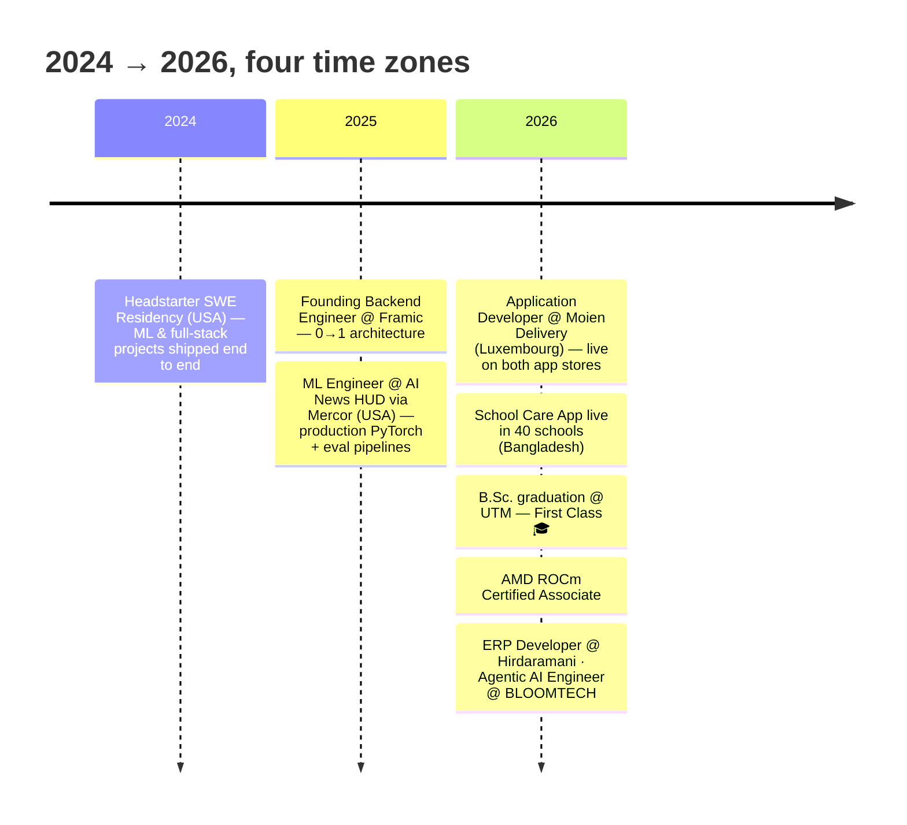

<div align="center">
  
</div>

<div align="center">
  <h1>👋 Hello, I'm Arnob!</h1>
  <p>
    
  </p>
  <p>
    <a href="https://arnobrizwan.github.io"></a>
    <a href="mailto:arnobrizwan23@gmail.com"></a>
    <a href="https://www.linkedin.com/in/arnob-rizwan-033704239/"></a>
    
  </p>
  <p>
    <a href="#-experience">💼 Experience</a> ·
    <a href="#-live--things-you-can-actually-open">🌐 Live</a> ·
    <a href="#-featured-projects">🌟 Projects</a> ·
    <a href="#%EF%B8%8F-tech-stack">🛠️ Stack</a> ·
    <a href="#-github-statistics">📊 Stats</a> ·
    <a href="#-lets-connect">🤝 Contact</a>
  </p>
  <p>
    
    
    
    
  </p>
</div>

## 🚀 About Me

```yaml
name: "Arnob Rizwan Ahmad"
located_in: "Chittagong, Bangladesh 🇧🇩 — open to Dhaka & remote"
education: "B.Sc. Software Engineering @ UTM — graduated July 2026, First Class"

currently:
  - "Agentic AI Engineer @ BLOOMTECH, Inc. (USA 🇺🇸, remote, part-time)"
  - "ERP Developer @ Hirdaramani Bangladesh 🇧🇩 (hybrid)"

previously:
  - "Application Developer @ Moien Delivery (Luxembourg 🇱🇺) — live on Play Store & App Store"
  - "ML Engineer @ AI News HUD via Mercor (USA 🇺🇸) — 70% → 78.9% accuracy, −20% latency"
  - "Founding Backend Engineer @ Framic (AI storage, remote)"
  - "Software Engineer @ MOMS Mobile Oil Change (USA 🇺🇸) — live production site"
  - "Software Engineering Resident @ Headstarter (USA 🇺🇸)"

what_i_actually_build:
  - "Agentic workflows — multi-step LLM planning, tool/API integration, structured output"
  - "RAG over FAISS & pgvector"
  - "Evaluation harnesses — blinded LLM judges, per-category scoring, regression gates"
  - "The FastAPI / PostgreSQL / Docker / Kubernetes backend underneath it all"

certified: "AMD ROCm Certified Associate (2026)"
open_to: ["AI/LLM Engineering", "Agents & Evaluation", "Python Backend", "Full-Stack"]
```

### 🗺️ The journey so far



## 💼 Experience

<details open>
<summary><b>🤖 Agentic AI Engineer — BLOOMTECH, Inc. · USA 🇺🇸 (Remote, Part-time) · Aug 2026 – Present</b></summary>
<br>

> Agentic AI systems and LLM-driven tooling

- Build agentic AI workflows in **Python** — multi-step LLM planning, tool and API integration, and structured output handling
- Design **prompt and evaluation loops** that measure and improve agent reliability across task categories
- Work across OpenAI, Anthropic and Gemini APIs with **LangChain / LangGraph** and CrewAI

</details>

<details open>
<summary><b>🏭 Enterprise Resource Planning Developer — Hirdaramani Bangladesh 🇧🇩 (Hybrid) · Jul 2026 – Present</b></summary>
<br>

> ERP systems for a multinational apparel manufacturing group

- Build and maintain **ERP modules** supporting production, inventory and order-management workflows across factory operations
- Write and tune **SQL against large operational datasets**; build reports and data integrations between ERP and internal systems
- Translate process requirements from operations and IT stakeholders into shipped features

</details>

<details>
<summary><b>📱 Application Developer — Moien Delivery · Luxembourg 🇱🇺 (Remote) · Mar 2026 – Jul 2026</b></summary>
<br>

> Hybrid logistics platform serving customers, restaurants and drivers — **live on Google Play & the App Store**

- Built the **Angular** web front-end and a cross-platform **React Native** app on a **Nuxt.js** backend, serving three distinct user roles
- Implemented real-time order tracking, driver dispatch and delivery workflow automation over REST APIs and **WebSocket event streams**
- Owned features spec → QA → production on weekly release cycles with international stakeholders

</details>

<details>
<summary><b>🧠 Machine Learning Engineer (via Mercor) — AI News HUD · USA 🇺🇸 (Remote) · Oct 2025 – Mar 2026</b></summary>
<br>

> US-based AI-powered news intelligence platform

- Built and evaluated **production PyTorch models** for real-time news classification, summarization and personalized recommendations
- Designed evaluation pipelines and ran iterative experiments on live traffic, raising news-classification accuracy **from 70% to 78.9%** and cutting inference latency **20%**
- Took ML components from prototype to deployed feature in the platform's core intelligence layer

</details>

<details>
<summary><b>⚙️ Founding Backend Engineer — Framic · Remote · Aug 2025 – Jul 2026</b></summary>
<br>

- First backend hire on an AI-powered storage app — owned **architecture decisions and core API design** from scratch
- Led **AI search**, real-time file indexing, and scalable gallery/drive systems
- Shipped fast alongside the founders while keeping the system maintainable as the team scaled

</details>

<details>
<summary><b>🔧 Software Engineer (Freelance) — MOMS Mobile Oil Change® · USA 🇺🇸 (Remote) · Apr 2026 – Jul 2026</b></summary>
<br>

> Production Next.js site for a US mobile oil change & fleet maintenance business — live at <a href="https://momsoilchange.com">momsoilchange.com</a>

- Redesigned the site header/nav — active-route highlighting, hover dropdowns, prominent phone CTA — and rebuilt three product pages
- SEO overhaul: dynamic sitemap route, 301s for legacy city URLs, consolidated `/locations/[city]` dynamic routing
- Ran a site-wide security, dependency and code-quality audit pass; repaired production-build breakages

</details>

<details>
<summary><b>🎓 Software Engineering Resident — Headstarter · USA 🇺🇸 (Remote) · Sep 2024 – Mar 2025</b></summary>
<br>

- Selected for a competitive 6-month US residency; shipped ML and full-stack projects end to end in Python and TypeScript
- Designed and trained neural networks — LLM chaining, hyperparameter tuning, fine-tuning
- Built **LLM agents on AWS Bedrock/OpenAI** and optimized Docker CI/CD on GitHub Actions, cutting image size and build times

</details>

## 🌐 Live — things you can actually open

> Not repos. Shipped products with a URL or an install.

| Product | What it is | Link |
|---|---|---|
| **Moien Delivery** 🇱🇺 | Food delivery platform for Luxembourg — customer, restaurant and driver roles. I built the Angular web client and the React Native app. | [Google Play](https://play.google.com/store) · App Store |
| **MOMS Oil Change** 🇺🇸 | Live production site for a Philadelphia mobile oil-change business — header/nav redesign, three product pages, SEO overhaul | [momsoilchange.com](https://momsoilchange.com) |
| **Best Auto Rentals** | Car rental platform — booking flow, admin dashboard, provider-agnostic AI concierge with output validation, 80 tests across 20 suites | [bestauto-rentals.vercel.app](https://bestauto-rentals.vercel.app) |
| **SafeCurve** | Three.js blind-curve driving simulation backing a road-safety study, packaged with Capacitor into a 4 MB offline Android APK | [safecurve-sim.vercel.app](https://safecurve-sim.vercel.app) |
| **PhotoniX Research** | Production site for a photonics & laser research group — publications, team, news, recruitment | [photonixresearch.com](https://photonixresearch.com) |
| **JobPortal** | Job application platform — company profiles, listings, candidate leaderboard, blog | [jobportal-blush.vercel.app](https://jobportal-blush.vercel.app) |
| **ZeroWaste Hub** 🇲🇾 | Food-rescue app — Gemini vision grades dish quality & halal status, on-device TFLite classifier, 4 languages | Signed APK & IPA on Releases |
| **School Care App** 🇧🇩 | School management system in daily use across **40 schools** in Sylhet — React admin + React Native app, role-targeted FCM push | Private distribution |
| **ShopLocalr** 🇲🇾 | Flutter local-business discovery app — QR deal redemption, Gemini recommendations, offline-first Hive caching | Client deployment, no public link |

## 🌟 Featured Projects

<div align="center">
  <table>
    <tr>
      <td width="50%">
        <h3 align="center">🤖 Autonomous ML Agent</h3>
        <div align="center">
          <a href="https://github.com/Arnobrizwan/Autonomous-ML-Agent" target="_blank">
            
          </a>
          <p><strong>Python · Optuna · SHAP · CI/CD</strong><br>LLM-planned AutoML: profiling → tuning → ensembles → model cards</p>
        </div>
      </td>
      <td width="50%">
        <h3 align="center">🍛 ZeroWaste Hub</h3>
        <div align="center">
          <a href="https://github.com/Arnobrizwan/ZeroWaste-Hub" target="_blank">
            
          </a>
          <p><strong>Flutter · Gemini Vision · TFLite</strong><br>Food-rescue app for Malaysia — APK shipped, 4 languages</p>
        </div>
      </td>
    </tr>
    <tr>
      <td width="50%">
        <h3 align="center">🌾 CrisisCohort</h3>
        <div align="center">
          <a href="https://github.com/Arnobrizwan/-CrisisCohort" target="_blank">
            
          </a>
          <p><strong>AWS Bedrock · Lambda · Solidity</strong><br>Multi-agent climate-resilience platform for smallholder farmers</p>
        </div>
      </td>
      <td width="50%">
        <h3 align="center">🛰️ EcoSphere Farming Sim</h3>
        <div align="center">
          <a href="https://github.com/Arnobrizwan/ecosphere-ai-farming-simulator" target="_blank">
            
          </a>
          <p><strong>React Native · NASA APIs · Gemini</strong><br>Farming sim on live SMAP/MODIS/IMERG satellite data</p>
        </div>
      </td>
    </tr>
    <tr>
      <td width="50%">
        <h3 align="center">⌨️ Terminal Coding Agent</h3>
        <div align="center">
          <a href="https://github.com/Arnobrizwan/Terminal-Based-Coding-Agent" target="_blank">
            
          </a>
          <p><strong>Python · E2B Sandboxes · Guardrails</strong><br>CLI agent that writes, runs & debugs code in Firecracker microVMs</p>
        </div>
      </td>
      <td width="50%">
        <h3 align="center">🔁 Self-Improving Prompt API</h3>
        <div align="center">
          <a href="https://github.com/Arnobrizwan/Self-Improving-Prompt-Optimization-Api" target="_blank">
            
          </a>
          <p><strong>FastAPI · LLM Judge · Evals</strong><br>CI/CD for prompts — blinded judging & auto-promotion loops</p>
        </div>
      </td>
    </tr>
  </table>
</div>

<details>
<summary><b>🔒 Private, client & contributor builds — click to explore what's not pinnable</b></summary>
<br>

| Project | What it is | Stack |
|---|---|---|
| **MOMS Mobile Oil Change®** 🇺🇸 | Contributor on the live production site — header redesign, SEO/sitemap overhaul, security audit. **Live at [momsoilchange.com](https://momsoilchange.com)** | Next.js · React · TypeScript |
| **MentorMind** | EdTech platform as a system-design showcase — Postgres read replication, Redis leaderboards, Celery, OpenCV proctoring, DVC MLOps, k8s + Prometheus/Grafana | Django · Kubernetes · DVC |
| **CivicPulse** | Civic-data pipeline — multi-source connectors, union-find dedupe, weighted ranking, LLM summaries, 1,200+ LOC of tests | Python · Next.js · Redis |
| **School Care App** 🇧🇩 | School management suite **adopted by 40 schools** in Sylhet — role-targeted FCM push, attendance, homework, admin dashboard | React Native · Firebase |
| **Qawel** | WhatsApp-style construction PM — voice notes, daily reports → PDF, EN/AR/UR auto-translation with RTL | Flutter · Cloud Functions |
| **Savora RMS** | Restaurant management — POS, KDS, inventory; every KPI computed server-side | .NET 10 · React 19 · SQL Server |
| **ScholarMind** | Fully-local research assistant — FAISS RAG over PDFs with Llama 3 via Ollama, citations in 4 formats | Flask · FAISS · Ollama |
| **Sushthotha** | Bilingual (EN/বাংলা) mental-wellness platform — context-aware micro-action engine, crisis flows | React 19 · Gemini · Cloud Run |
| **Agritech** 🇧🇩 | Bangladesh rice supply chain — XGBoost yield ensemble on district-level data, profit simulator | XGBoost · Prisma · Socket.IO |
| **PhotoniX Research** | Research group site + admin CMS — **live at [photonixresearch.com](https://photonixresearch.com)** | React · Express · MySQL |

</details>

<p align="center">➕ Full project archive with write-ups: <a href="https://arnobrizwan.github.io">arnobrizwan.github.io</a></p>

## 🛠️ Tech Stack

<details open>
<summary><b>Languages</b></summary>
<p align="left">
  
</p>
</details>

<details open>
<summary><b>AI / ML</b></summary>
<p align="left">
  
</p>
<p><code>AWS Bedrock</code> <code>Gemini</code> <code>RAG — FAISS · pgvector</code> <code>Ollama / Llama 3</code> <code>XGBoost · Optuna · SHAP</code> <code>LLM judges & evals</code> <code>Multi-agent systems</code></p>
</details>

<details>
<summary><b>Frameworks & Mobile</b></summary>
<p align="left">
  
</p>
</details>

<details>
<summary><b>Cloud, Data & DevOps</b></summary>
<p align="left">
  
</p>
</details>

## 🐍 Watch the snake eat my contributions

<div align="center">
  <picture>
    <source media="(prefers-color-scheme: dark)" srcset="https://raw.githubusercontent.com/Arnobrizwan/Arnobrizwan/output/github-snake-dark.svg" />
    
  </picture>
</div>

## 📊 GitHub Statistics

<div align="center">
  
  
</div>

<div align="center">
  
</div>

<div align="center">
  
</div>

## 🎓 Education & Certifications

- 🎓 **B.Sc. Software Engineering (Computer Science)** — Universiti Teknologi Malaysia · **graduated July 2026, First Class**
- 🏅 **AMD** — ROCm Certified Associate (Aug 2026 – Aug 2028)
- 📜 **AWS** — Building Language Models on AWS · Customizing & Evaluating LLMs with SageMaker JumpStart · SageMaker JumpStart Foundations · Foundations of Prompt Engineering (Mar 2025)
- 🧩 **IBM** — Full Stack Software Developer Professional Certificate (Aug 2024)
- 🏆 **Microsoft Azure AI** — Azure OpenAI Service, NLP, Document Intelligence (Jun 2024)
- 🚀 **Headstarter** — Software Engineering Residency, USA (Sep 2024 – Mar 2025)

## 🤝 Let's Connect!

<div align="center">
  <p>Got a role, a contract, or a wild idea? My inbox is open.</p>
  <a href="https://arnobrizwan.github.io">
    
  </a>
  <a href="mailto:arnobrizwan23@gmail.com">
    
  </a>
  <a href="https://www.linkedin.com/in/arnob-rizwan-033704239/">
    
  </a>
</div>

---

<div align="center">
  
  <p><strong>⭐ Star a repo if something here is useful to you!</strong></p>
</div>
